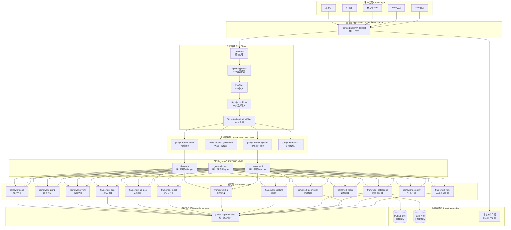
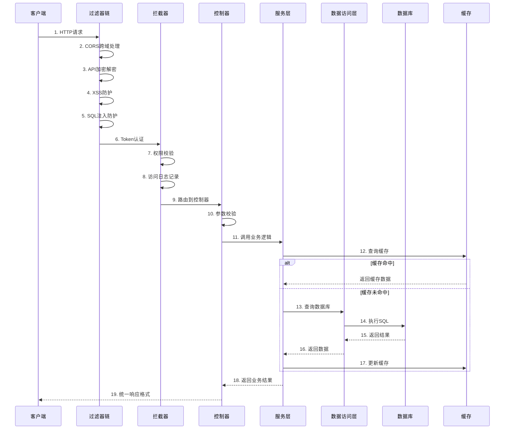
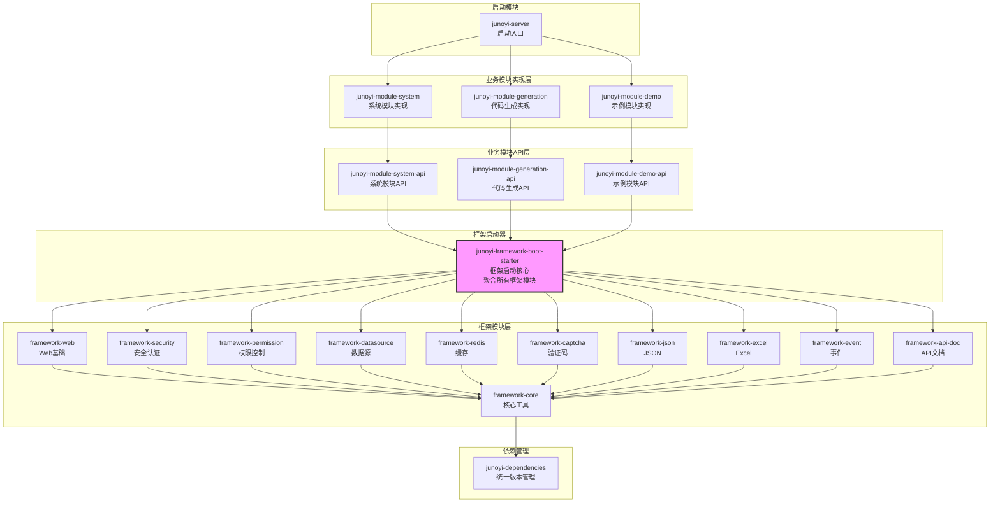

<div align="center">
    
</div>

<div align="center">

[](https://www.oracle.com/java/)
[](https://spring.io/projects/spring-boot)
[](https://baomidou.com/)
[](LICENSE)
[](https://github.com/Juno-Yi/JunoYi)

## JunoYi 后台管理系统脚手架框架
**一个安全内建、简洁优雅的 Java 企业级开发框架**

[特性](#-核心特性) • [快速开始](#-快速开始) • [文档](#-文档) • [架构](#-项目架构) • [贡献](#-贡献指南) • [联系我们](#-联系我们)

 📖 [文档站](https://doc.framework.junoyi.com) • 🎮 [演示站](https://demo.junoyi.com)

</div>

---

> ⚠️ **Alpha 内测版本声明**
> 
> 当前版本为 **0.3.3-alpha**，属于内部测试版本。功能仍在持续开发和完善中，API 可能会有变动。欢迎试用并反馈问题，但暂不建议用于生产环境。
> 
> 📌 **相关链接**
> - 📖 文档站：https://doc.framework.junoyi.com  
> - 🎮 演示站：https://demo.junoyi.com
> 
> 演示站账号：
> 
> 超级管理员 - 账号：super_admin 密码：admin123
> 
> 用户管理员 - 账号：admin 密码：admin123
> 
> 用户1 - 账号：user1 密码：admin123

---

## �️ 版本绍规划

项目持续更新中，后续版本规划：

| 版本     | 说明 | 状态     |
|--------|------|--------|
| 前后端分离版 | 当前版本，适合中小型项目 | 🚧 测试版本 |
| 多租户版   | 支持 SaaS 多租户架构 | 📋 开发中 |
| 微服务版   | 基于 Spring Cloud 的分布式架构 | 📋 开发中 |

📝 更新日志请查看文档站：https://doc.framework.junoyi.com/changelog/standalone.html

---

## 📖 项目介绍

JunoYi（钧逸）是一个基于 **Spring Boot 3.5.0** 和 **Java 21** 打造的现代化企业级应用开发框架。提供更全面、更成熟、更可扩展的基础设施能力，专为现代企业级业务研发而生。

### ✨ 核心优势
- **企业级基础设施完善 :** 内置统一规范的架构设计、模块划分与扩展机制，显著降低项目搭建与长期维护成本。
- **专注业务，减少重复造轮子 :** 框架层承担通用能力建设，让开发者将精力集中在业务本身，而非基础防护与重复逻辑。
- **多端原生支持，一套代码多端适配 :** 天然支持 Web前台 / Web后台 / 移动端 / 小程序 / 桌面端多端接入，统一接口规范，降低多端协作成本。
- **混合权限模型，打破传统强耦合设计 :** 权限、角色、菜单完全解耦，不再被"菜单即权限"的旧范式限制，更符合真实企业业务场景。
- **安全能力内置，端到端加密通信 :** 内置接口级安全防护机制，实现端到端数据加密，让系统从架构层面更安全、更可靠。
- **面向长期演进的脚手架设计 :** 支持模块化扩展、插件化能力演进，适配中大型项目的持续迭代需求。

---

## 🚀 快速开始

### 环境要求

| 软件 | 版本要求 | 说明            |
| --- | --- |---------------|
| Java | 21 | 后端运行环境        |
| Maven | 3.9+ | 后端打包构建环境      |
| MySQL | 8.0+ | SQL 数据库       |
| Redis | 7.0+ | 缓存数据库         |
| IDEA | 2024.x | Java 开发工具（可选） |
| Navicat | 任意 | 数据库可视化工具(可选）  |
| DataGrip | 任意 | 数据库可视化工具（可选）|
| Apifox | 任意 | 接口调试工具(可选) |
| Postman | 任意 | 接口调试工具(可选) |

### 启动步骤

**1、Git 克隆本仓库**

```
git clone https://github.com/Juno-Yi/JunoYi.git
```

> Github地址： https://github.com/Juno-Yi/JunoYi.git
> 
> Gitee地址：https://gitee.com/juno-yi/JunoYi.git
>
> 两者Clone下来都是最新版本

**2、导入数据库**

创建数据库，
将目录 `sql` 中的对应版本的数据库SQL，在工具中导入到数据库中。

确保启动了 Redis缓存数据库

**3、修改 application YAML 配置文件**

```yaml
    # 文件输出配置
    file:
      # 是否启用文件日志输出
      enabled: true
      # 日志文件存储目录（只提供目录，不包含文件名）
      path: ./temp/logs
      # 单个日志文件的最大大小（支持KB、MB、GB单位）
      max-size: 100MB
      # 保留的历史日志文件数量（超过数量的旧文件会被删除）
      max-history: 30
      # 所有日志文件的总大小上限（超过后会删除最旧的文件）
      total-size-cap: 1GB
      # 是否压缩历史日志文件（true=压缩为.gz格式，false=不压缩）
      compress: true
      # 日志文件编码格式
      encoding: UTF-8
```

将这里日志存储路径 `path` 改为自己的日志存储路径

```yaml
    api-encrypt:
      enable: false
      # 是否加密请求体
      request: true
      # 是否加密响应体
      response: true
      # 排除路径
      exclude-urls:
        - /swagger-ui/**
        - /v3/api-docs/**
        - /doc.html
        - /webjars/**
        - /your-custom-path/**
        - /system/info/logo
```

确保 `application.yml` 中的接口加密功能保持关闭，开发环境中需要将其设置为关闭，方便调试，生产环境设置为开启


```yaml
          url: jdbc:mysql://localhost:3306/junoyi?useUnicode=true&characterEncoding=utf8&serverTimezone=Asia/Shanghai&useSSL=false&allowPublicKeyRetrieval=true&rewriteBatchedStatements=true
          username: root
          password: 123456
```

将 `application-local.yml` 中的数据库url改为自己的数据库url，以及将 `username`、`password` 设置为自己的账号密码

```yaml
  # ==================== Redis 配置 ====================
  data:
    redis:
      host: 127.0.0.1
      port: 6379
      database: 1
      timeout: 10s
      # password: 123456
```

Redis配置，默认redis是没有密码的，如果有需要自行设置

**4、启动项目**

确保在自己的IDEA环境中，项目使用的 Java 为 Java 17，
找到打开 `junoyi-server` 模块，该模块为项目主入口模块，启动运行打包都在该模块下，
`com.junoyi.server` 软件包下 `JunoYiServerApplication` 主类。启动运行主类中的主函数。

或 `maven` 启动 SpringBoot
```bash
mvn spring-boot:run
```

**5、成功启动项目**
```text
[2026-01-19 17:21:59.032] (main                          ) c.j.s.JunoYiServerApplica...   [INFO] 
  - Started JunoYiServerApplication in 2.985 seconds (process running for 3.228)
[2026-01-19 17:21:59.032] (main                          ) JUNOYI                         [INFO] 
  - Local:      http://localhost:7588
[2026-01-19 17:21:59.032] (main                          ) JUNOYI                         [INFO] 
  - External:   http://10.18.40.110:7588
[2026-01-19 17:21:59.033] (main                          ) JUNOYI                         [INFO] 
  - Host Name:  fanzijiandeMacBook-Pro.local
[2026-01-19 17:21:59.036] (main                          ) c.j.s.JunoYiServerApplica...   [INFO] 
  - [JunoYi Server] Startup completed. System is now operational.

  _ _/|
 \'o.0'
 =(___)=
    U
```

控制台日志输出结果为这样，表示启动成功！

可以通过访问 API 接口文档来测试是否成功运行！

```text
http://localhost:7588/doc.html
```

---

## 📚 文档

完整文档请访问：**https://doc.framework.junoyi.com**

| 分类 | 内容 |
|------|------|
| 🚀 快速开始 | 环境准备、项目启动、基础配置 |
| 🏗️ 架构设计 | 项目结构、模块划分、技术选型 |
| 🔐 权限系统 | 混合权限模型、RBAC、字段级权限 |
| 🛡️ 安全防护 | XSS/SQL注入防护、端到端加密 |
| 📝 开发指南 | 模块开发、对象转换、日志框架 |
| 🔌 组件集成 | 验证码、API文档、缓存管理 |


```
JunoYi
├── junoyi-dependencies        # 依赖版本管理
├── junoyi-framework           # 框架核心模块
│   ├── junoyi-framework-core          # 核心工具类
│   ├── junoyi-framework-web           # Web 基础设施
│   ├── junoyi-framework-security      # 安全认证
│   ├── junoyi-framework-permission    # 权限控制
│   ├── junoyi-framework-datasource    # 数据源配置
│   ├── junoyi-framework-redis         # Redis 缓存
│   ├── junoyi-framework-captcha       # 验证码
│   ├── junoyi-framework-api-doc       # API 文档
│   ├── junoyi-framework-log           # 日志框架
│   └── ...
├── junoyi-module              # 业务模块
│   ├── junoyi-module-system           # 系统管理
│   └── junoyi-module-demo             # 示例模块
├── junoyi-module-api          # 模块 API 定义
├── junoyi-server              # 启动入口
└── junoyi-ui                  # 前端项目
```


---

## 🏗️ 项目架构

整体架构


请求处理流程图

模块依赖关系图


**依赖说明**：
1. **junoyi-server** 只依赖业务模块实现（system、demo 等）
2. **业务模块实现** 依赖对应的 **API 模块**
3. **API 模块** 统一依赖 **framework-boot-starter**
4. **boot-starter** 聚合了所有框架模块，简化依赖管理
5. 所有框架模块最终依赖 **framework-core** 核心模块
6. **dependencies** 统一管理所有模块的版本号

框架层详细架构
```mermaid
graph TB
    subgraph "junoyi-framework-web Web基础设施"
        W1[统一异常处理<br/>GlobalExceptionHandler]
        W2[跨域配置<br/>CorsConfiguration]
        W3[XSS防护<br/>XssFilter]
        W4[SQL注入防护<br/>SqlInjectionFilter]
        W5[访问日志<br/>AccessLogInterceptor]
        W6[统一响应封装<br/>Result]
    end
    
    subgraph "junoyi-framework-security 安全认证"
        S1[JWT Token生成<br/>JwtTokenHelper]
        S2[Token认证过滤器<br/>TokenAuthenticationFilter]
        S3[RSA加密解密<br/>RsaCryptoHelper]
        S4[API加密过滤器<br/>ApiEncryptFilter]
        S5[密码工具<br/>PasswordUtils]
        S6[会话管理<br/>SessionHelper]
    end

    subgraph "junoyi-framework-permission 权限控制"
        P1[权限注解<br/>@Permission]
        P2[权限切面<br/>PermissionAspect]
        P3[权限匹配器<br/>PermissionMatcher]
        P4[字段权限<br/>@FieldPermission]
        P5[字段脱敏<br/>MaskUtils]
        P6[权限助手<br/>PermissionHelper]
    end
    
    subgraph "junoyi-framework-datasource 数据源管理"
        DS1[MyBatis-Plus配置<br/>MyBatisPlusConfig]
        DS2[分页插件<br/>PaginationInterceptor]
        DS3[数据权限<br/>DataScopeHandler]
        DS4[慢SQL监控<br/>SlowSqlInterceptor]
        DS5[SQL美化<br/>SqlBeautifyInterceptor]
        DS6[动态数据源<br/>DynamicDataSource]
    end
    
    subgraph "junoyi-framework-redis 缓存管理"
        R1[Redis工具类<br/>RedisUtils]
        R2[Redisson配置<br/>RedissonConfig]
        R3[分布式锁<br/>Lock4j]
        R4[缓存注解<br/>@Cacheable]
    end
    
    subgraph "junoyi-framework-captcha 验证码"
        CA1[图形验证码<br/>ImageCaptcha]
        CA2[滑块验证码<br/>SlideCaptcha]
        CA3[验证码存储<br/>CaptchaStore]
        CA4[验证码助手<br/>CaptchaHelper]
    end
    
    subgraph "junoyi-framework-log 日志框架"
        L1[日志配置<br/>JunoYiLoggingConfig]
        L2[日志工具<br/>JunoYiLog]
        L3[操作日志<br/>@OperationLog]
        L4[日志切面<br/>LogAspect]
    end
    
    subgraph "junoyi-framework-core 核心工具"
        C1[统一返回<br/>Result]
        C2[分页对象<br/>PageQuery/PageResult]
        C3[基础异常<br/>BaseException]
        C4[工具类<br/>Utils]
        C5[常量定义<br/>Constants]
        C6[对象转换<br/>MapStruct]
    end
```

权限系统架构
```mermaid
graph TB
    subgraph "权限模型 Permission Model"
        PM1[用户 User]
        PM2[角色 Role]
        PM3[权限 Permission]
        PM4[菜单 Menu]
        PM5[部门 Dept]
        PM6[用户组 UserGroup]
        PM7[角色组 RoleGroup]
        PM8[权限组 PermGroup]
        PM9[部门组 DeptGroup]
    end
    
    subgraph "权限关系 Relations"
        R1[用户-角色<br/>N:N]
        R2[角色-权限<br/>N:N]
        R3[用户-权限<br/>N:N 直接授权]
        R4[用户-部门<br/>N:N]
        R5[用户-用户组<br/>N:N]
        R6[角色-角色组<br/>N:N]
        R7[权限-权限组<br/>N:N]
        R8[部门-部门组<br/>N:N]
    end
    
    subgraph "权限控制 Access Control"
        AC1[接口权限<br/>@Permission]
        AC2[字段权限<br/>@FieldPermission]
        AC3[数据权限<br/>@DataScope]
        AC4[菜单权限<br/>Menu Control]
    end
    
    PM1 --> R1 --> PM2
    PM2 --> R2 --> PM3
    PM1 --> R3 --> PM3
    PM1 --> R4 --> PM5
    PM1 --> R5 --> PM6
    PM2 --> R6 --> PM7
    PM3 --> R7 --> PM8
    PM5 --> R8 --> PM9
    
    PM3 --> AC1 & AC2 & AC3
    PM4 --> AC4
```


---

## 🤝 贡献指南

欢迎提交 Issue 和 Pull Request！

### 贡献流程

1. Fork 本项目
2. 创建新分支 (`git checkout -b feature/AmazingFeature`)
3. 提交更改 (`git commit -m 'Add some AmazingFeature'`)
4. 推送到分支 (`git push origin feature/AmazingFeature`)
5. 提交 Pull Request

### 代码审查

所有 PR 都需要经过代码审查才能合并。请确保：

- 代码符合项目规范
- 添加了必要的测试
- 更新了相关文档
- 通过了所有 CI 检查

---

## 📞 联系我们

如果你在使用过程中遇到问题，或者有任何建议，欢迎通过以下方式联系我们：

- **QQ 群**：1074033133
- **邮箱**：eatfan0921@163.com

<div align="center">
    
    <p>扫码加入 QQ 群</p>
</div>

---

## ☕ 捐赠赞助

如果这个项目对你有帮助，欢迎请作者喝杯咖啡 ☕

<div align="center">
<table>
<tr>
<td align="center">
    <br/>
    <b>微信</b>
</td>
<td align="center">
    <br/>
    <b>支付宝</b>
</td>
</tr>
</table>
</div>

---

## 📄 许可证

本项目采用 MIT 许可证 - 详见 [LICENSE](LICENSE) 文件

---

[](https://www.star-history.com/#Juno-Yi/JunoYi&type=date&legend=top-left)

---

<div align="center">

**⭐ 如果这个项目对你有帮助，请给个 Star 支持一下！**

Made with ❤️ by JunoYi Team

</div>
