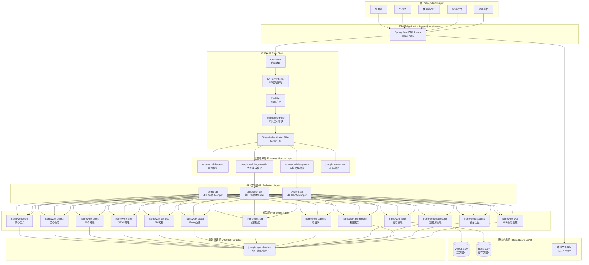
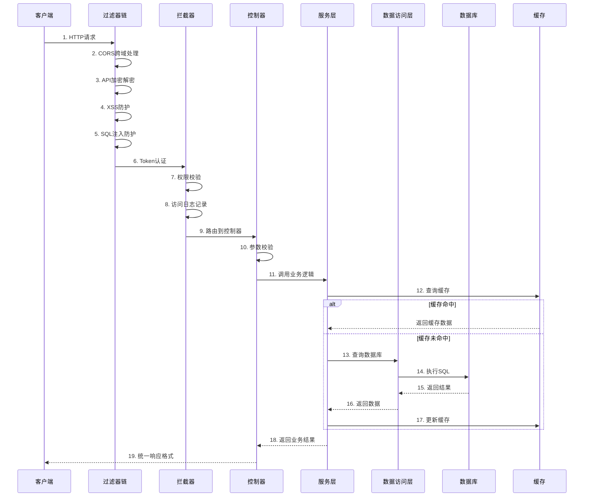
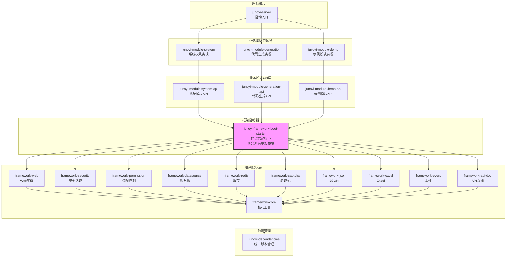
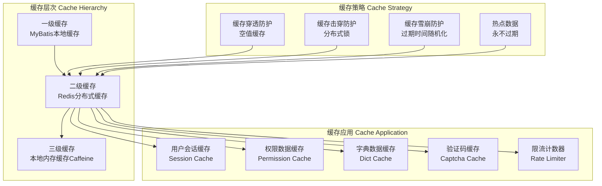
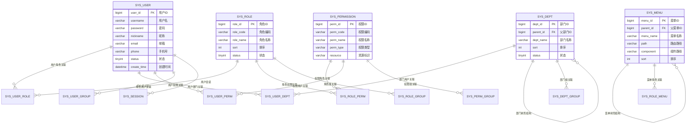
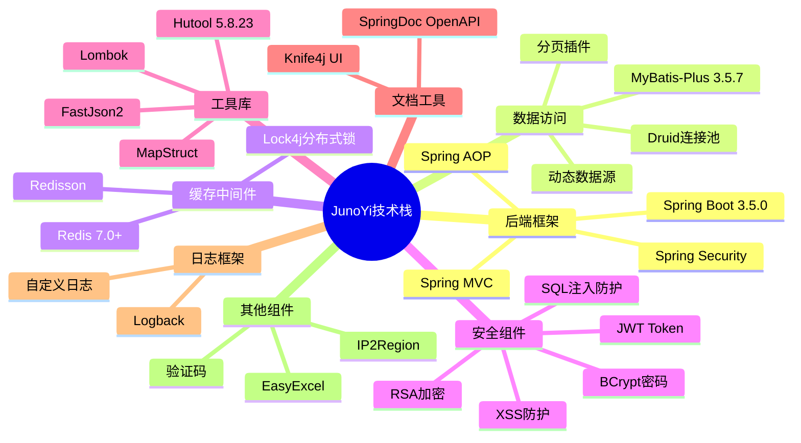
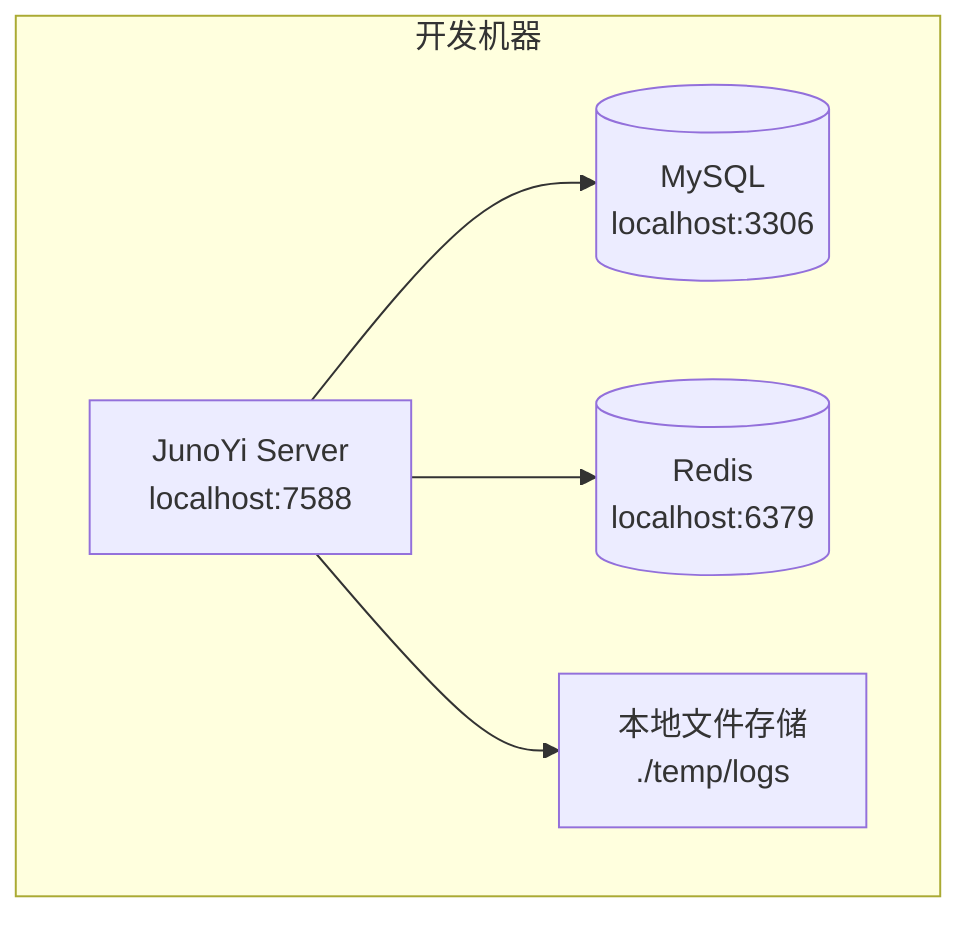
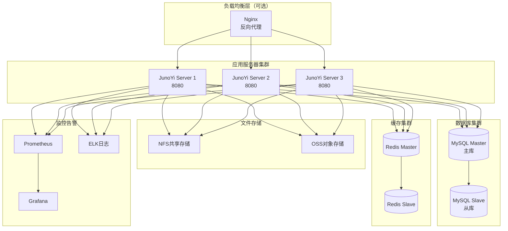

# JunoYi 后端系统架构图

## 一、整体架构图（单体架构）



---

## 二、请求处理流程图



---

## 三、模块依赖关系图



**依赖说明**：
1. **junoyi-server** 只依赖业务模块实现（system、demo 等）
2. **业务模块实现** 依赖对应的 **API 模块**
3. **API 模块** 统一依赖 **framework-boot-starter**
4. **boot-starter** 聚合了所有框架模块，简化依赖管理
5. 所有框架模块最终依赖 **framework-core** 核心模块
6. **dependencies** 统一管理所有模块的版本号

---

## 四、框架层详细架构

```mermaid
graph TB
    subgraph "junoyi-framework-web Web基础设施"
        W1[统一异常处理<br/>GlobalExceptionHandler]
        W2[跨域配置<br/>CorsConfiguration]
        W3[XSS防护<br/>XssFilter]
        W4[SQL注入防护<br/>SqlInjectionFilter]
        W5[访问日志<br/>AccessLogInterceptor]
        W6[统一响应封装<br/>Result]
    end
    
    subgraph "junoyi-framework-security 安全认证"
        S1[JWT Token生成<br/>JwtTokenHelper]
        S2[Token认证过滤器<br/>TokenAuthenticationFilter]
        S3[RSA加密解密<br/>RsaCryptoHelper]
        S4[API加密过滤器<br/>ApiEncryptFilter]
        S5[密码工具<br/>PasswordUtils]
        S6[会话管理<br/>SessionHelper]
    end

    subgraph "junoyi-framework-permission 权限控制"
        P1[权限注解<br/>@Permission]
        P2[权限切面<br/>PermissionAspect]
        P3[权限匹配器<br/>PermissionMatcher]
        P4[字段权限<br/>@FieldPermission]
        P5[字段脱敏<br/>MaskUtils]
        P6[权限助手<br/>PermissionHelper]
    end
    
    subgraph "junoyi-framework-datasource 数据源管理"
        DS1[MyBatis-Plus配置<br/>MyBatisPlusConfig]
        DS2[分页插件<br/>PaginationInterceptor]
        DS3[数据权限<br/>DataScopeHandler]
        DS4[慢SQL监控<br/>SlowSqlInterceptor]
        DS5[SQL美化<br/>SqlBeautifyInterceptor]
        DS6[动态数据源<br/>DynamicDataSource]
    end
    
    subgraph "junoyi-framework-redis 缓存管理"
        R1[Redis工具类<br/>RedisUtils]
        R2[Redisson配置<br/>RedissonConfig]
        R3[分布式锁<br/>Lock4j]
        R4[缓存注解<br/>@Cacheable]
    end
    
    subgraph "junoyi-framework-captcha 验证码"
        CA1[图形验证码<br/>ImageCaptcha]
        CA2[滑块验证码<br/>SlideCaptcha]
        CA3[验证码存储<br/>CaptchaStore]
        CA4[验证码助手<br/>CaptchaHelper]
    end
    
    subgraph "junoyi-framework-log 日志框架"
        L1[日志配置<br/>JunoYiLoggingConfig]
        L2[日志工具<br/>JunoYiLog]
        L3[操作日志<br/>@OperationLog]
        L4[日志切面<br/>LogAspect]
    end
    
    subgraph "junoyi-framework-core 核心工具"
        C1[统一返回<br/>Result]
        C2[分页对象<br/>PageQuery/PageResult]
        C3[基础异常<br/>BaseException]
        C4[工具类<br/>Utils]
        C5[常量定义<br/>Constants]
        C6[对象转换<br/>MapStruct]
    end
```

---

## 五、系统模块详细架构

```mermaid
graph TB
    subgraph "系统管理模块 junoyi-module-system"
        SYS1[用户管理<br/>SysUserController]
        SYS2[角色管理<br/>SysRoleController]
        SYS3[菜单管理<br/>SysMenuController]
        SYS4[部门管理<br/>SysDeptController]
        SYS5[权限管理<br/>SysPermissionController]
        SYS6[会话管理<br/>SysSessionController]
        SYS7[缓存管理<br/>SysCacheController]
        SYS8[认证授权<br/>SysAuthController]
        SYS9[验证码<br/>SysCaptchaController]
        SYS10[路由管理<br/>SysRouterController]
    end
    
    subgraph "服务层 Service"
        SVC1[用户服务<br/>ISysUserService]
        SVC2[角色服务<br/>ISysRoleService]
        SVC3[菜单服务<br/>ISysMenuService]
        SVC4[部门服务<br/>ISysDeptService]
        SVC5[权限服务<br/>ISysPermissionService]
        SVC6[会话服务<br/>ISysSessionService]
        SVC7[缓存服务<br/>ISysCacheService]
        SVC8[认证服务<br/>ISysAuthService]
        SVC9[验证码服务<br/>ISysCaptchaService]
        SVC10[路由服务<br/>ISysRouterService]
    end
    
    subgraph "数据访问层 Mapper"
        MAP1[用户Mapper<br/>SysUserMapper]
        MAP2[角色Mapper<br/>SysRoleMapper]
        MAP3[菜单Mapper<br/>SysMenuMapper]
        MAP4[部门Mapper<br/>SysDeptMapper]
        MAP5[权限Mapper<br/>SysPermissionMapper]
        MAP6[用户角色Mapper<br/>SysUserRoleMapper]
        MAP7[用户部门Mapper<br/>SysUserDeptMapper]
        MAP8[用户权限Mapper<br/>SysUserPermMapper]
    end
    
    SYS1 --> SVC1
    SYS2 --> SVC2
    SYS3 --> SVC3
    SYS4 --> SVC4
    SYS5 --> SVC5
    SYS6 --> SVC6
    SYS7 --> SVC7
    SYS8 --> SVC8
    SYS9 --> SVC9
    SYS10 --> SVC10
    
    SVC1 --> MAP1
    SVC2 --> MAP2
    SVC3 --> MAP3
    SVC4 --> MAP4
    SVC5 --> MAP5
    SVC1 --> MAP6 & MAP7 & MAP8
```



---

## 六、权限系统架构

```mermaid
graph TB
    subgraph "权限模型 Permission Model"
        PM1[用户 User]
        PM2[角色 Role]
        PM3[权限 Permission]
        PM4[菜单 Menu]
        PM5[部门 Dept]
        PM6[用户组 UserGroup]
        PM7[角色组 RoleGroup]
        PM8[权限组 PermGroup]
        PM9[部门组 DeptGroup]
    end
    
    subgraph "权限关系 Relations"
        R1[用户-角色<br/>N:N]
        R2[角色-权限<br/>N:N]
        R3[用户-权限<br/>N:N 直接授权]
        R4[用户-部门<br/>N:N]
        R5[用户-用户组<br/>N:N]
        R6[角色-角色组<br/>N:N]
        R7[权限-权限组<br/>N:N]
        R8[部门-部门组<br/>N:N]
    end
    
    subgraph "权限控制 Access Control"
        AC1[接口权限<br/>@Permission]
        AC2[字段权限<br/>@FieldPermission]
        AC3[数据权限<br/>@DataScope]
        AC4[菜单权限<br/>Menu Control]
    end
    
    PM1 --> R1 --> PM2
    PM2 --> R2 --> PM3
    PM1 --> R3 --> PM3
    PM1 --> R4 --> PM5
    PM1 --> R5 --> PM6
    PM2 --> R6 --> PM7
    PM3 --> R7 --> PM8
    PM5 --> R8 --> PM9
    
    PM3 --> AC1 & AC2 & AC3
    PM4 --> AC4
```

---

## 七、数据权限架构

```mermaid
graph LR
    subgraph "数据权限类型 DataScope Types"
        DS1[全部数据<br/>ALL]
        DS2[本部门数据<br/>DEPT]
        DS3[本部门及下级<br/>DEPT_AND_CHILD]
        DS4[仅本人数据<br/>SELF]
        DS5[自定义数据<br/>CUSTOM]
    end
    
    subgraph "权限处理流程"
        P1[请求进入]
        P2[检查@DataScope注解]
        P3[获取用户权限范围]
        P4[构建SQL过滤条件]
        P5[MyBatis拦截器]
        P6[动态添加WHERE条件]
        P7[执行SQL]
        P8[返回过滤后数据]
    end
    
    P1 --> P2
    P2 --> P3
    P3 --> DS1 & DS2 & DS3 & DS4 & DS5
    DS1 & DS2 & DS3 & DS4 & DS5 --> P4
    P4 --> P5
    P5 --> P6
    P6 --> P7
    P7 --> P8
```

---

## 八、安全防护体系

```mermaid
graph TB
    subgraph "请求安全 Request Security"
        RS1[CORS跨域防护<br/>CorsFilter]
        RS2[XSS攻击防护<br/>XssFilter]
        RS3[SQL注入防护<br/>SqlInjectionFilter]
        RS4[CSRF防护<br/>CsrfFilter]
    end

    subgraph "认证安全 Authentication Security"
        AS1[JWT Token认证<br/>TokenAuthenticationFilter]
        AS2[Token刷新机制<br/>RefreshToken]
        AS3[会话管理<br/>SessionHelper]
        AS4[单点登录<br/>SSO]
        AS5[多端登录控制<br/>MultiDevice]
    end
    
    subgraph "数据安全 Data Security"
        DS1[API加密解密<br/>ApiEncryptFilter]
        DS2[RSA非对称加密<br/>RsaCryptoHelper]
        DS3[密码加密<br/>BCrypt]
        DS4[字段脱敏<br/>@FieldPermission]
        DS5[敏感数据加密<br/>AES]
    end
    
    subgraph "权限安全 Authorization Security"
        PS1[接口权限校验<br/>@Permission]
        PS2[角色权限校验<br/>@RequiresRoles]
        PS3[数据权限过滤<br/>@DataScope]
        PS4[字段权限控制<br/>FieldPermission]
    end
    
    subgraph "审计安全 Audit Security"
        AU1[访问日志<br/>AccessLog]
        AU2[操作日志<br/>OperationLog]
        AU3[异常日志<br/>ErrorLog]
        AU4[登录日志<br/>LoginLog]
    end
```

---

## 九、缓存架构



---

## 十、数据库架构



---

## 十一、技术栈详情



---

## 十二、部署架构

### 开发环境（单机部署）



### 生产环境（可选集群部署）



**说明**：
- 单体架构支持单机部署（开发/小型项目）
- 也支持多实例集群部署（生产环境/高可用）
- 通过 Nginx 实现负载均衡和高可用
- 数据库和缓存可配置主从复制

---

## 十三、核心特性总结

### 1. 单体架构优势
- **部署简单**：一个 JAR 包即可运行
- **开发高效**：无需考虑分布式事务和服务调用
- **调试方便**：本地即可完整调试
- **成本低**：适合中小型项目，无需复杂基础设施
- **可扩展**：支持水平扩展（多实例部署）

### 2. 模块化设计
- 采用 Maven 多模块架构
- 模块职责清晰，低耦合高内聚
- 支持模块独立开发和测试
- 为未来微服务化预留空间

### 3. 安全防护体系
- 多层次安全防护（请求、认证、数据、权限）
- 端到端加密通信（RSA + AES）
- XSS、SQL注入、CSRF 防护
- 完善的审计日志

### 4. 混合权限模型
- 用户、角色、权限、菜单完全解耦
- 支持用户直接授权
- 支持分组管理（用户组、角色组、权限组、部门组）
- 数据权限精细控制（全部/部门/部门及下级/本人/自定义）

### 5. 高性能缓存
- 多级缓存架构（MyBatis 本地缓存 + Redis 分布式缓存）
- 缓存穿透/击穿/雪崩防护
- 分布式锁支持（Redisson + Lock4j）
- 热点数据预加载

### 6. 开发效率
- 统一异常处理
- 统一返回格式
- 对象自动转换（MapStruct）
- API文档自动生成（SpringDoc + Knife4j）
- 代码生成器

### 7. 可扩展性
- 插件化设计
- 事件驱动架构（Spring Event）
- 动态数据源支持
- 支持多端接入（Web/移动端/小程序/桌面端）

### 8. 架构演进路径
```
当前：单体架构（前后端分离版）
  ↓
未来：多租户版（SaaS 架构）
  ↓
未来：微服务版（Spring Cloud）
```

---

## 十四、版本信息

- **当前版本**: 0.3.4-alpha
- **Java版本**: 21
- **Spring Boot**: 3.5.0
- **MyBatis-Plus**: 3.5.7
- **文档更新**: 2026-01-19

---

**文档说明**: 本架构图使用 Mermaid 语法绘制，可在支持 Mermaid 的 Markdown 编辑器中查看完整效果。
